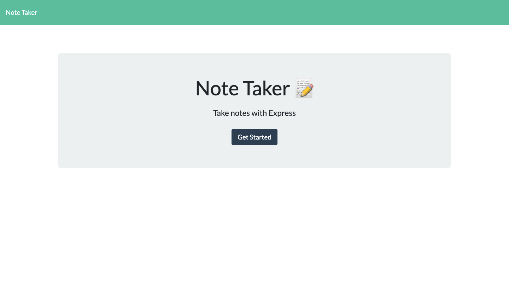
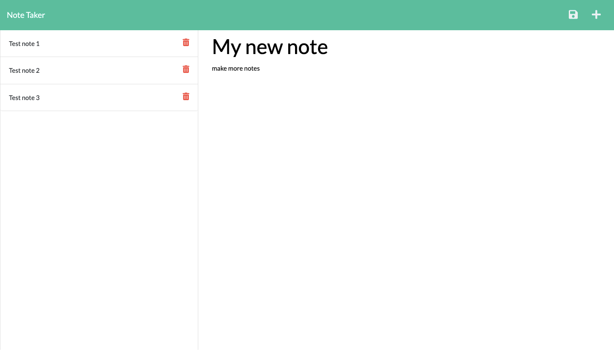
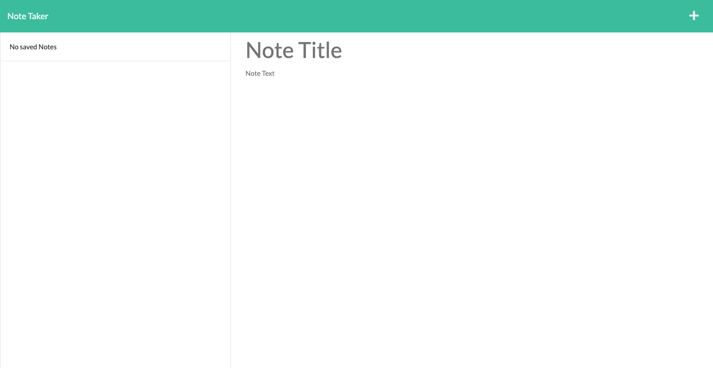

# Title: my-note-taker


## Description 📕

This application was built using Node.js and Express.js for the back end, and can be used to write and save notes. The data from the notes is currently saved and read from a JSON file.note

### Installation 🔍

```
git clone git@github.com:roxywasiak/my-note-taker.git
cd my-note-taker
npm i
```

### Launch the app 🚀

```
npm run start
```

## Deployed App 🖥

The application is deployed on Heroku please find it [here](https://protected-brushlands-48747.herokuapp.com/)

## Screenshots 📸

Home page


Add notes / Delete notes


No saved notes


## Contact Me 👋

## If you require more information about this application just drop me an [email](mailto:ruksclone@hotmail.com)
